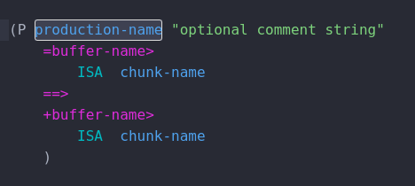

# language-actr package

A very preliminary version of syntax highlighting for the cognitive modeling language [ACT-R](http://act-r.psy.cmu.edu/).
Some keywords are recognized (e.g. ISA, chunk-type) and buffer-names are treated like functions.
Code folding works (thanks to the code already written for 'normal' lisp).

Files with the extension ".lisp" are recognized and highlighted accordingly.

I copied the stuff in grammars/actr.cson mostly from a github page on lisp syntax highlighting here:
https://github.com/enriquefernandez/language-lisp

Edit the file ```grammars/actr.cson``` if you want to add some patterns to be highlighted or change existing ones.

There is a snippet now, too. Starting to type "production" should open a suggestion on your cursor called production, if you hit enter it will write the structure for a new production.
You can fill it out using tab to go from place to place to complete.
Add or change here: ```snippets/language-actr.cson```
This is how it looks like:

